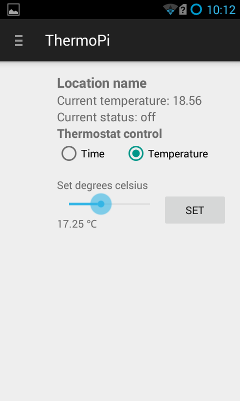
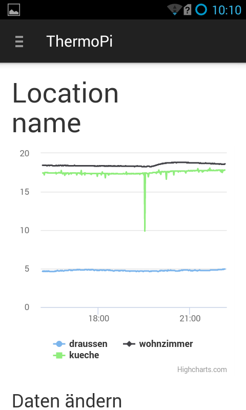
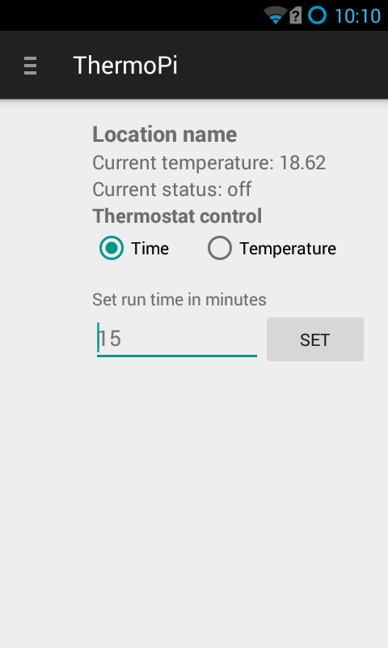

# thermoAndroidPi

Android App to control your ThermoRaspberryPi

## Requirements

* https://github.com/tdashton/thermoRaspberryPiWeb
* https://github.com/tdashton/thermoRaspberryPi
* Android Studio and an Android phone.

## What

* Set the thermostat temperature remotely or set a timed run of the thermostat.
* Display the current status of the thermostat: if it is running or not.
* See a graph history what the temperature has been.

## Screenshots

  
